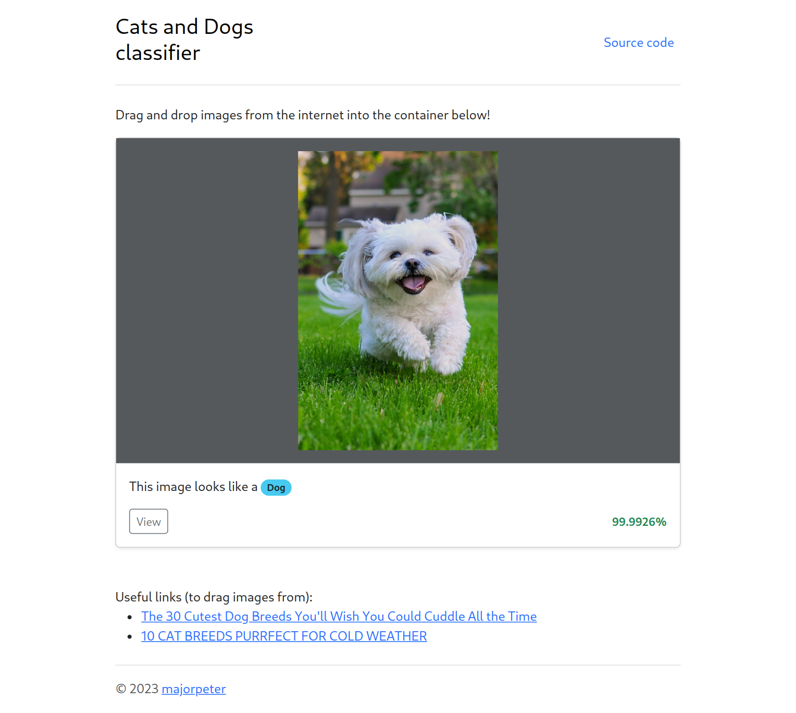

# Cats and Dogs classifier

This repository contains the [Jupyter notebook](cats-vs-dogs.ipynb) that was used to train a model and also the minimalistic TFJS application that runs in the browser and decides whether an image is a cat image or a dog image.

